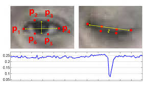

# CURSOR-CONTROL-USING-FACE-GESTURES

## OVERVIEW

Computer Vision is used for catering the needs of the users who are invalid in the sense that they are not able to perform basic operations on the computer such as the use of mouse. Without the use of any physical help, the user can now be able to use the mouse using simple facial gestures such as blinking. Blinking of left or right eye will initiate a left or right click respectively.

Many of the products related to this project are present in the market and are often expensive or require some external hardware for configuration. In this project, we aim at designing a similar product which does not require any external hardware and is open – sourced.

A face is divided into 68 distinct landmarks, rather than taking the entire face into account, which makes the working algorithm very fast. Exploiting the orientation of the points on the eye, we use the concept of Eye Aspect Ratio, which is used to determine whether the eye is open or closed.

For scrolling on the page, we have used the concept of Mouth Aspect Ratio, which is just used to determine whether the mouth is open or closed. Opening the mouth for about 5 seconds will activate the scrolling mode and the mouse which used to move up and down will now scroll up and down. For deactivating the scroll one, the user can do the same action again.

For moving the mouse cursor across the screen, the user must move the nose out of a reference circle. In whatever direction the user keeps their nose with respect to the centre of the circle, the mouse will move in that direction. Keeping the nose tip in the reference circle will stop the moving cursor.

The above code was tested and run on Intel® Core™ i5-8250U CPU @ 1.60GHz × 8. All the code was written on gedit file in Ubuntu version 18.04.02 LTS

## REQUIREMENTS
* numpy==1.16.4 
* scipy==1.3.0 
* matplotlib==3.1.0 
* dlib==19.17.0 
* imutils==0.5.2 
* opencv-python==4.1.0
* pyautogui==0.9.4

## SAMPLE IMAGE FOR CALIBRATION

